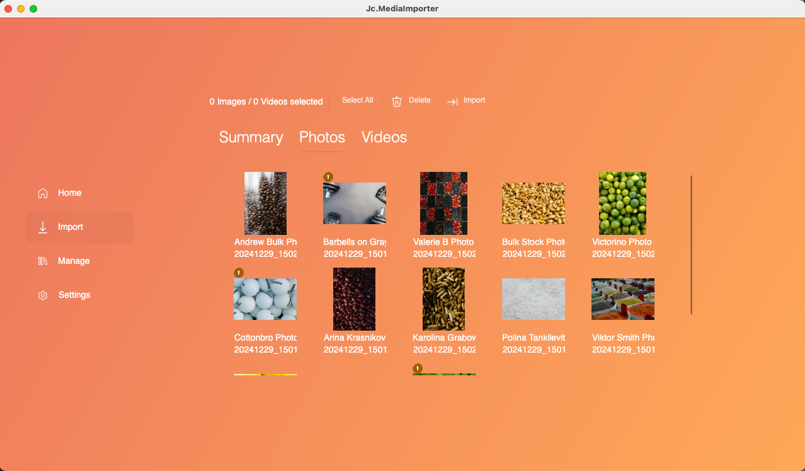

# Jc.MediaImporter



A simple GUI application that allows me to conveniently import media (photos/videos) captured from various devices in the family.

## About

A while back after starting my family, it became quickly apparent there was no real convenient way to manage photos and videos captured across all our devices and put them on server in the correct shape without requiring a week to go through everything.

I created an initial version in .NET Core Windows Forms but this no longer works now I'm daily driving a Mac. So `Jc.MediaImporter` was born.

## How it Works

You select source directory and load media. For me personaly, I have a `Drop` directory containing a subdirectory for each member of the family which is accessible from their devices via NextCloud.

From there, you can click load to see all the files found recursively and the expected out put name for the file. The retrieval of information leverages `MetadataExtractor` to extract EXIF data to more accurately produce a creation time instead of trying to parse file names manually, where some devices don't even produce media files with dated names.

You then select a target root directory and click import. From here, the files are deployed as such:

```
/ target directory
-- / Photos
----- / YYYY-MM
-------- / YYYYMMDD_HH:mm:ss.{extension}
...
-- / Home Videos
----- / Captured
-------- / YYYY-MM
----------- / YYYYMMDD_HH:mm:ss.{extension}
```

_Note: videos are imported into a `Captured` directory as these sit in wait for me to produce monthly or yearly compilations to avoid short time videos appearing in Plex, etc._

## Things I'd Like to Add

This was just thrown together to get it up and running now I'm on a Mac, but I wanted to share the source as it's not anything particularly big or powerful but may help someone. This does however mean it's currently limited to my specific use case.

- Make the naming conventions configurable
- Make the UI a little nicer on the eyes
- Maybe handle more than just photos and videos
